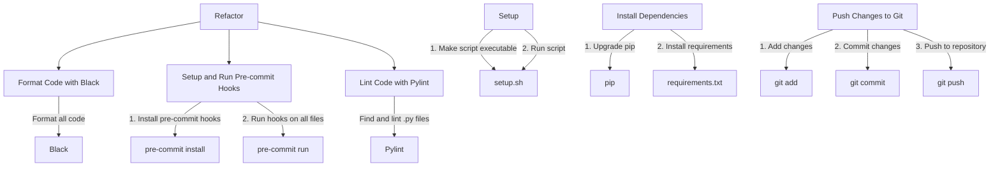

# containerized-transcription-api

```mermaid
graph TB
  setup[Setup]
  install[Install Dependencies]
  format[Format Code with Black]
  lint[Lint Code with Pylint]
  precommit[Setup and Run Pre-commit Hooks]
  refactor[Refactor]
  push[Push Changes to Git]

  setup -->|1. Make script executable| setup.sh[setup.sh]
  setup -->|2. Run script| setup.sh
  install -->|1. Upgrade pip| pip[pip]
  install -->|2. Install requirements| requirements[requirements.txt]
  format -->|Format all code| black[Black]
  lint -->|Find and lint .py files| pylint[Pylint]
  precommit -->|1. Install pre-commit hooks| pre-commit-install[pre-commit install]
  precommit -->|2. Run hooks on all files| pre-commit-run[pre-commit run]
  refactor --> format
  refactor --> precommit
  refactor --> lint
  push -->|1. Add changes| git-add[git add]
  push -->|2. Commit changes| git-commit[git commit]
  push -->|3. Push to repository| git-push[git push]

```
