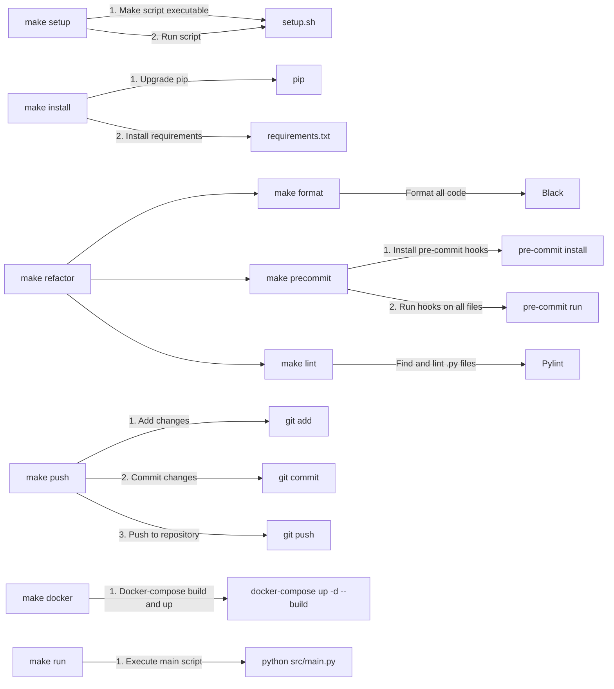

# containerized-transcription-api

```mermaid
graph LR
  setup[make setup]
  setup -->|1. Make script executable| setup.sh[setup.sh]
  setup -->|2. Run script| setup.sh

  install[make install]
  install -->|1. Upgrade pip| pip[pip]
  install -->|2. Install requirements| requirements[requirements.txt]

  format[make format]
  format -->|Format all code| black[Black]

  lint[make lint]
  lint -->|Find and lint .py files| pylint[Pylint]

  precommit[make precommit]
  precommit -->|1. Install pre-commit hooks| pre-commit-install[pre-commit install]
  precommit -->|2. Run hooks on all files| pre-commit-run[pre-commit run]

  refactor[make refactor]
  refactor --> format
  refactor --> precommit
  refactor --> lint

  push[make push]
  push -->|1. Add changes| git-add[git add]
  push -->|2. Commit changes| git-commit[git commit]
  push -->|3. Push to repository| git-push[git push]

  docker[make docker]
  docker -->|1. Docker-compose build and up| docker-compose[docker-compose up -d --build]

  run[make run]
  run -->|1. Execute main script| main-script[python src/main.py]

```
