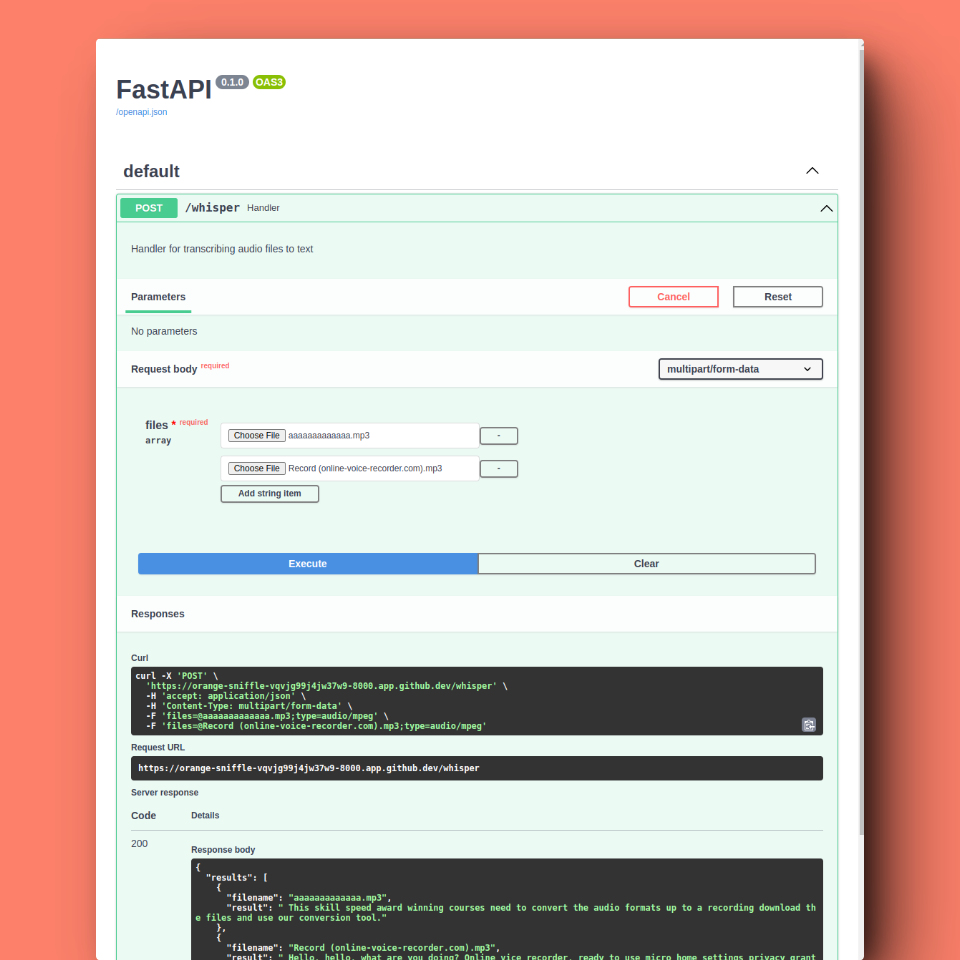
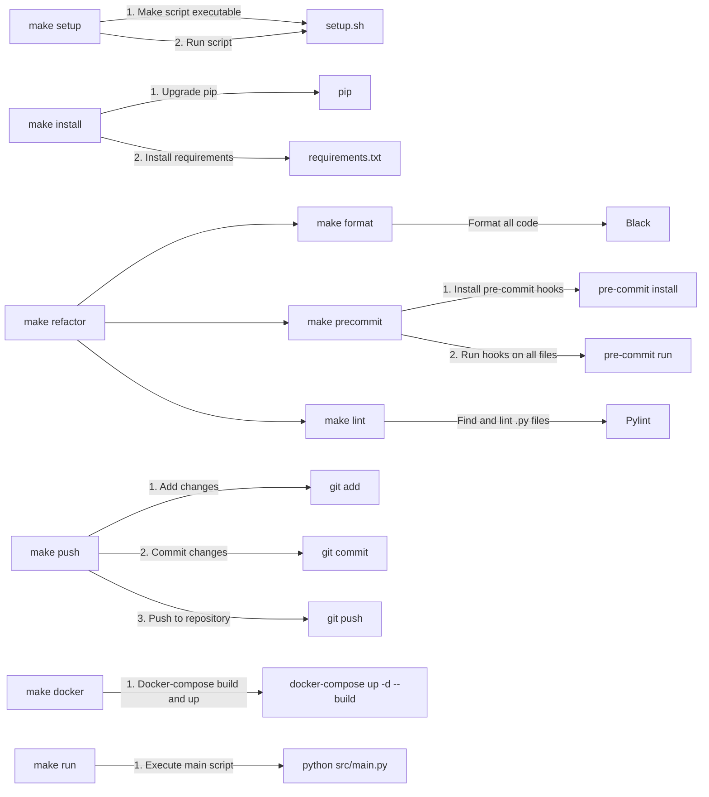

# containerized-transcription-api

[](https://github.com/buildberg/containerized-transcription-api/actions/workflows/docker-publish.yml)


### Overview
This project sets up a robust web application using FastAPI. It integrates the open-source Whisper AI model for Speech-to-Text (STT) transcription, enabling accurate and efficient audio-to-text conversion. The application is containerized using Docker, ensuring consistent and efficient runtime in any environment.
### Features
* **FastAPI Backend:** A high-performance, easy-to-learn backend.
* **Whisper AI Integration:** Cutting-edge STT transcription.
* **Dockerized:** Simplified deployment, scalability, and management.
### Why this project?
Whether you want to automate your transcription tasks, enhance accessibility for your content, or explore the world of AI-powered applications, this project has you covered.
### Installation
1. Clone the repository
```
git clone https://github.com/buildberg/containerized-transcription-api
```
2. Navigate into the project folder
```
cd containerized-transcription-api
```
3. Build and run Docker container
```
make docker
```

### Usage
Convert Audio to Text
```bash
POST /whisper
```
Body Params: **audio_file: file**


